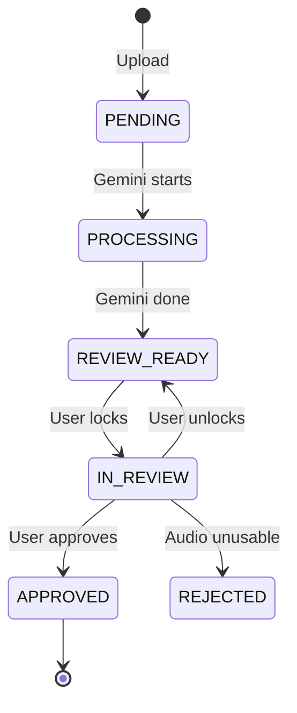

# Workflow Guide: Vietnamese-English Code-Switching Speech Translation Pipeline

**Version**: 2.0  
**Date**: December 2025

---

## Table of Contents

1. [Quick Start](#1-quick-start)
2. [Ingestion Workflow](#2-ingestion-workflow)
3. [Processing Workflow](#3-processing-workflow)
4. [Annotation Workflow](#4-annotation-workflow)
5. [Operations Workflow](#5-operations-workflow)
6. [Export Workflow](#6-export-workflow)
7. [Troubleshooting](#7-troubleshooting)

---

## 1. Quick Start

### Prerequisites

- Python 3.10+
- Node.js 18+
- PostgreSQL 15+
- FFmpeg (in PATH)
- DeepFilterNet (`pip install deepfilternet`)

### Initial Setup

```powershell
# 1. Create PostgreSQL database
# In psql:
CREATE DATABASE speech_translation_db;

# 2. Clone and setup
cd final_nlp
python -m venv .venv
.\.venv\Scripts\Activate.ps1
pip install -r requirements.txt

# 3. Configure environment
copy .env.example .env
# Edit .env with your PostgreSQL password and Gemini API keys

# 4. Initialize database
python scripts/init_db.py

# 5. Start backend
uvicorn backend.main:app --reload --port 8000

# 6. Start frontend (new terminal)
cd frontend
npm install
npm run dev
```

### Access Points

| Service | URL | Purpose |
|---------|-----|---------|
| Frontend | http://localhost:5173 | Annotation workbench |
| API Docs | http://localhost:8000/docs | Swagger UI |
| Health Check | http://localhost:8000/health | Server status |

---

## 2. Ingestion Workflow

### 2.1 Using the Tkinter GUI

```powershell
python ingest_gui.py
```

**Steps**:

1. **Enter URL**: Paste YouTube video or playlist URL
2. **Click Fetch**: Expands playlist, shows video list
3. **Select User**: Choose your annotator account from dropdown
4. **Select Channel**: Choose or create the source channel
5. **Check Duplicates**: Highlights videos already in database
6. **Download Selected**: Downloads and uploads to server

```
┌─────────────────────────────────────────────────────────┐
│ 🎙️ Speech Translation - YouTube Ingestion              │
├─────────────────────────────────────────────────────────┤
│ URL: https://youtube.com/playlist?list=...   [Fetch]   │
├─────────────────────────────────────────────────────────┤
│ User: [Chien ▼]    Channel: [Vietcetera ▼]             │
├─────────────────────────────────────────────────────────┤
│ ╔═══════════════════════════════════════════════════╗  │
│ ║ Title                        │ Duration │ Status  ║  │
│ ╠═══════════════════════════════════════════════════╣  │
│ ║ Episode 101: Startup Talk    │ 45:23    │ ✓ OK    ║  │
│ ║ Episode 102: Tech News       │ 32:15    │ ⚠️ Dup  ║  │
│ ╚═══════════════════════════════════════════════════╝  │
├─────────────────────────────────────────────────────────┤
│ [Select All] [Check Duplicates] [Download Selected]    │
├─────────────────────────────────────────────────────────┤
│ Log: ✓ Downloaded Episode 101                          │
└─────────────────────────────────────────────────────────┘
```

### 2.2 Manual API Upload

```bash
# Check for duplicate
curl "http://localhost:8000/api/videos/check?url=https://youtube.com/watch?v=abc123"

# Upload audio file
curl -X POST "http://localhost:8000/api/videos/upload" \
  -H "X-User-ID: 1" \
  -F "audio=@video.m4a" \
  -F "title=Episode 101" \
  -F "duration_seconds=2723" \
  -F "original_url=https://youtube.com/watch?v=abc123" \
  -F "channel_id=1"
```

---

## 3. Processing Workflow

### 3.1 Chunking

After upload, split the video into 5-minute chunks:

```powershell
# Process specific video
python -m backend.processing.chunker 1

# Process all unprocessed videos
python -m backend.processing.chunker --all
```

**What happens**:
1. Reads video from `data/raw/`
2. Creates 5-min WAV files in `data/chunks/video_{id}/`
3. Each chunk has 5-second overlap with the next
4. Output: 16kHz, Mono, 16-bit PCM

```
Video (45 minutes)
    ↓
┌─────────────────────────────────────────────────────┐
│ Chunk 0   │ Chunk 1   │ Chunk 2   │  ...  │ Chunk 8 │
│ 0:00-5:05 │ 5:00-10:05│ 10:00-15:05│      │45:00-end│
└─────────────────────────────────────────────────────┘
              ↑ 5s overlap
```

### 3.2 AI Transcription

After chunking, send to Gemini for transcription:

```powershell
# Process specific chunk
python -m backend.processing.gemini_worker 1

# Process up to 10 pending chunks
python -m backend.processing.gemini_worker --all 10
```

**What happens**:
1. Uploads audio to Gemini API
2. Receives JSON with timestamps and text
3. Parses and converts timestamps to floats
4. Inserts segments into database
5. Sets chunk status to `REVIEW_READY`

**API Key Rotation**: If one key hits quota, automatically rotates to next key in pool.

---

## 4. Annotation Workflow

### 4.1 Starting Review

1. Open http://localhost:5173
2. Select your user from dropdown
3. Frontend automatically fetches next available chunk
4. Click **Start Review** to acquire lock

### 4.2 Chunk States



### 4.3 Editing Segments

**Waveform Controls**:
- Click region to select segment
- Drag edges to adjust timestamps
- `Ctrl+Space` to play/pause

**Table Controls**:
- Edit transcript/translation inline
- Click checkbox to verify segment
- Click save icon to persist changes

### 4.4 Flagging for Denoise

If audio is noisy:
1. Toggle "Flag for Denoise" switch
2. Continue editing normally
3. Night shift will process with DeepFilterNet

### 4.5 Approving Chunk

When satisfied with all segments:
1. Click **Approve & Next**
2. Lock is released
3. Chunk status → `APPROVED`
4. Next chunk is automatically fetched

---

## 5. Operations Workflow

### 5.1 Denoising Queue

Run manually or schedule as cron job:

```powershell
# Check queue status
python -m backend.operations.denoiser --status

# Process flagged chunks
python -m backend.operations.denoiser --limit 10
```

**Output**:
```
Denoise Queue Status:
  not_needed: 45
  flagged: 5
  queued: 0
  processed: 12

Processing up to 10 flagged chunks...
Denoising: chunk_003.wav
  -> Output: chunk_003_denoised.wav
Results: {'success': 5, 'failed': 0, 'skipped': 0}
```

### 5.2 Automating Operations

**Windows Task Scheduler**:
```powershell
# Create scheduled task to run denoiser every night at 2 AM
$action = New-ScheduledTaskAction -Execute "python" -Argument "-m backend.operations.denoiser --limit 50"
$trigger = New-ScheduledTaskTrigger -Daily -At 2am
Register-ScheduledTask -TaskName "DenoiseNightShift" -Action $action -Trigger $trigger
```

---

## 6. Export Workflow

### 6.1 Running Export

```powershell
# Export specific video
python -m backend.operations.exporter --video-id 1

# Export all approved videos
python -m backend.operations.exporter --all
```

### 6.2 Overlap Resolution

The export handles 5-second overlaps automatically:

```
Chunk N:     |-------- seg1 --------|-- seg2 --|
             0s                    280s       305s
                                         ↑ overlap zone

Chunk N+1:   |-- seg2' --|-------- seg3 --------|
             0s         10s                    300s

After resolution:
- seg1: kept from Chunk N
- seg2/seg2': seg2' from Chunk N+1 is kept (more context)
- seg3: kept from Chunk N+1
```

### 6.3 Output Format

**Manifest TSV** (`data/export/manifest.tsv`):

```tsv
id	video_id	audio_path	start	end	duration	transcript	translation
1	1	chunks/video_1/chunk_000.wav	0.000	5.230	5.230	Hello các bạn	Xin chào các bạn
2	1	chunks/video_1/chunk_000.wav	5.230	12.450	7.220	Hôm nay chúng ta...	Hôm nay chúng ta...
```

**Columns**:
- `id`: Segment ID (unique)
- `video_id`: Source video
- `audio_path`: Path to WAV file relative to DATA_ROOT
- `start`/`end`: **Absolute** timestamps in seconds
- `duration`: Segment length
- `transcript`: Original Vietnamese/English text
- `translation`: Vietnamese translation

---

## 7. Troubleshooting

### Database Connection Failed

```
Error: could not connect to server
```

**Solution**:
1. Check PostgreSQL is running: `pg_isready`
2. Verify DATABASE_URL in `.env`
3. Check firewall allows port 5432

### Gemini API Quota Exceeded

```
Error: 429 RESOURCE_EXHAUSTED
```

**Solution**:
1. Add more API keys to `GEMINI_API_KEYS` in `.env`
2. Worker automatically rotates keys on failure
3. Wait for quota reset (daily limit)

### FFmpeg Not Found

```
FileNotFoundError: [Errno 2] No such file or directory: 'ffmpeg'
```

**Solution**:
1. Install FFmpeg: `choco install ffmpeg` or download from https://ffmpeg.org
2. Add to PATH: `$env:PATH += ";C:\ffmpeg\bin"`

### Chunk Already Locked

```
HTTP 409: Chunk is locked by Alice until 2025-12-09 22:30:00
```

**Solution**:
- Wait for lock expiry (30 minutes max)
- Ask Alice to unlock via frontend
- Admin can manually clear: `UPDATE chunks SET locked_by_user_id = NULL WHERE id = X`

### DeepFilterNet Not Working

```
FileNotFoundError: 'deepfilter' not found
```

**Solution**:
```powershell
pip install deepfilternet
# May need CUDA for GPU acceleration
```

### Frontend Can't Connect to API

```
Failed to load users. Is the backend running on port 8000?
```

**Solution**:
1. Check backend is running: `curl http://localhost:8000/health`
2. Check Vite proxy config in `frontend/vite.config.ts`
3. Verify CORS origins in `backend/main.py`

---

## Appendix: Command Reference

| Command | Description |
|---------|-------------|
| `uvicorn backend.main:app --reload` | Start FastAPI backend |
| `cd frontend && npm run dev` | Start React frontend |
| `python scripts/init_db.py` | Initialize/seed database |
| `python ingest_gui.py` | Launch ingestion GUI |
| `python -m backend.processing.chunker <video_id>` | Chunk a video |
| `python -m backend.processing.gemini_worker <chunk_id>` | Transcribe a chunk |
| `python -m backend.operations.denoiser --status` | Check denoise queue |
| `python -m backend.operations.exporter --all` | Export all approved |
| `alembic upgrade head` | Run database migrations |
| `alembic revision --autogenerate -m "message"` | Create migration |
